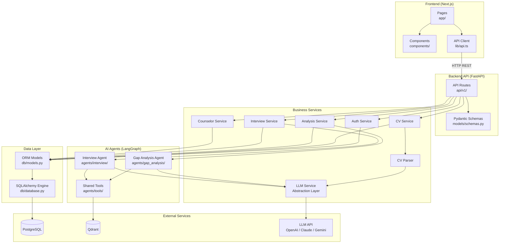
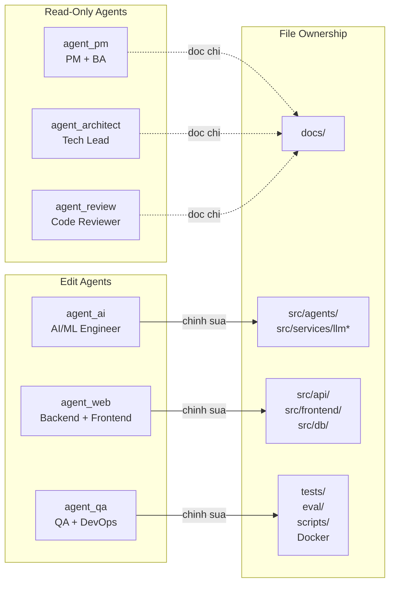
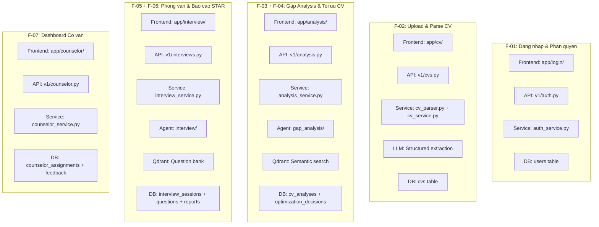
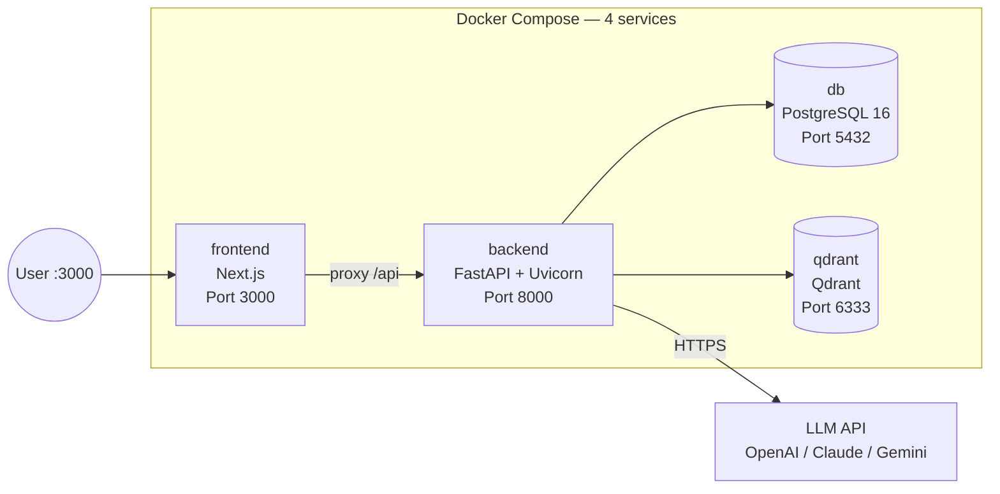
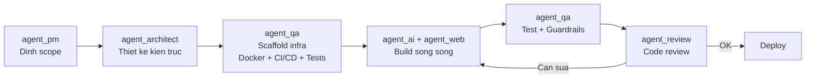

# Component Diagram — CV Assistant (my_version)

> **Ma du an:** P-041 (my_version) | **Phien ban:** v1.0 | **Ngay:** 14/08/2026
> **Tac gia:** agent_architect (Tech Lead & System Architect)

---

## 1. Cau truc thu muc du an

```
P-041 (my_version)/
├── docs/                          # Tai lieu du an
│   ├── gate 1/                    # Phase 1: Brief, PRD, Competitive Analysis
│   ├── architecture/              # Phase 2: Kien truc he thong (tai lieu nay)
│   ├── pipeline/                  # Mo ta chi tiet cac pipeline
│   └── wireframes/                # Thiet ke giao dien
│
├── src/                           # Ma nguon chinh
│   ├── api/                       # Backend API (FastAPI)
│   │   ├── main.py                # Entry point FastAPI app
│   │   ├── routes.py              # Router chinh, include sub-routers
│   │   └── v1/                    # API version 1
│   │       ├── auth.py            # Dang nhap, dang ky, OAuth
│   │       ├── cvs.py             # Upload, xem, xoa CV
│   │       ├── jds.py             # Quan ly Job Descriptions
│   │       ├── analysis.py        # Gap Analysis, suggestions
│   │       ├── interviews.py      # Mock Interview sessions
│   │       ├── counselor.py       # Dashboard co van
│   │       └── enterprise.py      # Doanh nghiep (Phase 2)
│   │
│   ├── agents/                    # AI Agents (LangGraph)
│   │   ├── state.py               # State schemas (TypedDict)
│   │   ├── gap_analysis/          # CV Gap Analysis Agent
│   │   │   ├── graph.py           # LangGraph graph definition
│   │   │   ├── nodes.py           # Cac node: validate, extract, draft, guardrail
│   │   │   └── prompts.py         # Prompt templates cho LLM
│   │   ├── interview/             # Mock Interview Agent
│   │   │   ├── graph.py           # LangGraph graph definition
│   │   │   ├── nodes.py           # Cac node: generate_q, evaluate, report
│   │   │   └── prompts.py         # Prompt templates cho LLM
│   │   └── tools/                 # Shared tools cho agents
│   │       ├── qdrant_search.py   # Tim kiem Vector DB
│   │       ├── skill_normalizer.py # Chuan hoa ten ky nang
│   │       └── evidence_validator.py # Kiem tra hallucination
│   │
│   ├── services/                  # Business logic services
│   │   ├── cv_parser.py           # Parse PDF/DOCX, trich xuat text
│   │   ├── cv_service.py          # Logic CRUD cho CV
│   │   ├── analysis_service.py    # Logic Gap Analysis
│   │   ├── interview_service.py   # Logic Mock Interview
│   │   ├── counselor_service.py   # Logic dashboard co van
│   │   ├── auth_service.py        # Logic xac thuc va phan quyen
│   │   └── llm_service.py         # LLM abstraction (multi-provider)
│   │
│   ├── db/                        # Database layer
│   │   ├── database.py            # SQLAlchemy engine va session
│   │   ├── models.py              # ORM models (bang du lieu)
│   │   └── migrations/            # Alembic migrations
│   │       └── versions/          # Cac phien ban thay doi DB
│   │
│   ├── models/                    # Pydantic schemas
│   │   └── schemas.py             # Request/Response schemas
│   │
│   └── frontend/                  # Frontend (Next.js)
│       ├── app/                   # Next.js App Router
│       │   ├── layout.tsx         # Layout chinh
│       │   ├── page.tsx           # Trang chu
│       │   ├── login/             # Trang dang nhap
│       │   ├── dashboard/         # Dashboard SV
│       │   ├── cv/                # Upload va xem CV
│       │   ├── analysis/          # Gap Analysis
│       │   ├── interview/         # Phong phong van
│       │   └── counselor/         # Dashboard co van
│       ├── components/            # React components tai su dung
│       │   ├── ui/                # UI primitives (Button, Input, Card...)
│       │   ├── cv/                # CV-related components
│       │   ├── interview/         # Interview-related components
│       │   └── layout/            # Layout components (Navbar, Sidebar)
│       ├── lib/                   # Utilities va API client
│       │   ├── api.ts             # Axios/fetch wrapper goi backend
│       │   ├── auth.ts            # Auth helpers (JWT storage)
│       │   └── utils.ts           # Ham tien ich chung
│       └── styles/                # Tailwind config va global styles
│
├── tests/                         # Tests
│   ├── unit/                      # Unit tests
│   ├── integration/               # Integration tests
│   └── e2e/                       # End-to-end tests
│
├── eval/                          # LLM evaluation
│   ├── datasets/                  # Test datasets (CV/JD gia lap)
│   └── judges/                    # LLM-as-Judge scripts
│
├── scripts/                       # Scripts tien ich
│   ├── seed_jds.py                # Nap JD mau vao Qdrant
│   └── seed_questions.py          # Nap cau hoi phong van mau
│
├── docker-compose.yml             # Docker Compose (all services)
├── Dockerfile                     # Backend Dockerfile
├── .env.example                   # Mau bien moi truong
├── requirements.txt               # Python dependencies
├── CLAUDE.md                      # Rang buoc du an
└── README.md                      # Huong dan chay du an
```

---

## 2. Dependency Diagram — Cac module phu thuoc nhau nhu the nao



### Giai thich cac lop (layers)

| Lop | Vai tro | Quy tac |
|---|---|---|
| **Frontend** | Giao dien nguoi dung | Chi giao tiep voi Backend qua REST API. Khong truy cap truc tiep database hoac AI agents. |
| **API Routes** | Nhan request, tra response | Validate input (Pydantic), goi Service tuong ung, khong chua business logic. |
| **Services** | Business logic | Xu ly logic nghiep vu: kiem tra quyen, goi agent, doc/ghi DB. Day la lop quan trong nhat. |
| **Agents** | AI processing | Chay LangGraph graph, goi LLM, tim kiem Qdrant. Khong truy cap DB truc tiep (qua Service). |
| **Data** | Luu tru du lieu | ORM models va database connection. Chi duoc goi tu Services. |

---

## 3. Agent-to-File Ownership — Ai quan ly file nao

> Quy tac tu PRD: Moi agent chi duoc sua files trong pham vi quyen cua minh. Khong de nhieu agent sua cung file cung luc.

### 3.1 Bang phan quyen



### 3.2 Chi tiet phan quyen

| Agent | Vai tro | Duoc sua (Edit) | Khong duoc sua |
|---|---|---|---|
| **agent_pm** | PM + BA | Khong sua code. Chi doc va tao tai lieu `docs/` | Moi thu trong `src/`, `tests/` |
| **agent_architect** | Tech Lead + Architect | Khong sua code. Chi doc va thiet ke tai lieu `docs/architecture/` | Moi thu trong `src/`, `tests/` |
| **agent_ai** | AI/ML Engineer | `src/agents/`, `src/services/llm_service.py` | `src/api/`, `src/frontend/`, `src/db/`, `tests/` |
| **agent_web** | Backend + Frontend Dev | `src/api/`, `src/frontend/`, `src/db/`, `src/models/`, `src/services/` (tru llm*) | `src/agents/`, `tests/`, `eval/` |
| **agent_qa** | QA + DevOps | `tests/`, `eval/`, `scripts/`, `Dockerfile`, `docker-compose.yml`, `.github/` | `src/` (khong sua logic) |
| **agent_review** | Code Reviewer | Khong sua code. Chi doc va review | Moi thu |

### 3.3 Vung chong cheo va quy tac xu ly

Mot so file co the bi nhieu agent can sua:

| File/Folder | Agent co the can | Quy tac |
|---|---|---|
| `src/services/llm_service.py` | agent_ai (logic AI), agent_web (integration) | **agent_ai so huu**. agent_web chi duoc goi ham, khong sua noi dung. |
| `src/models/schemas.py` | agent_web (API schemas), agent_ai (agent state) | **agent_web so huu Pydantic schemas**. agent_ai dinh nghia state rieng trong `src/agents/state.py`. |
| `src/db/models.py` | agent_web (CRUD), agent_ai (can biet schema) | **agent_web so huu**. agent_ai chi doc, khong sua. |
| `requirements.txt` | agent_web, agent_ai, agent_qa | **agent_qa so huu**. Cac agent khac de nghi them package, agent_qa review va cap nhat. |
| `docker-compose.yml` | agent_qa, agent_web (can biet ports) | **agent_qa so huu**. |

---

## 4. Component-to-Feature Mapping



---

## 5. Deployment Architecture



### Docker Compose Services

| Service | Image | Port | Muc dich |
|---|---|---|---|
| **backend** | Custom (Python 3.11 + FastAPI) | 8000 | API server chinh |
| **frontend** | Custom (Node 20 + Next.js) | 3000 | Giao dien nguoi dung |
| **db** | `postgres:16-alpine` | 5432 | PostgreSQL database |
| **qdrant** | `qdrant/qdrant:latest` | 6333 | Vector database |

> **Luu y:** LLM Service (OpenAI / Claude / Gemini) la external API, khong chay trong Docker. Backend goi API cua ho qua HTTPS. API keys duoc cau hinh qua bien moi truong (`.env`).

### Bien moi truong quan trong

```env
# Database
DATABASE_URL=postgresql://user:pass@db:5432/cv_assistant
# Hoac cho dev: sqlite:///./dev.db

# Qdrant
QDRANT_HOST=qdrant
QDRANT_PORT=6333

# LLM
LLM_PROVIDER=openai         # openai | anthropic | google
LLM_MODEL=gpt-4o            # Model cu the
LLM_API_KEY=your_key_here   # KHONG BAO GIO COMMIT GIA TRI THAT

# Auth
JWT_SECRET_KEY=your_secret_here
JWT_ALGORITHM=HS256
JWT_EXPIRE_MINUTES=1440      # 24 gio

# Google OAuth
GOOGLE_CLIENT_ID=your_client_id
GOOGLE_CLIENT_SECRET=your_secret
```

---

## 6. Quy trinh phat trien de xuat



### Thu tu trien khai theo Sprint

| Sprint | Thoi gian | Components can xay | Agent chinh |
|---|---|---|---|
| **Sprint 1** | Tuan 1-2 | Auth (api/auth, db/users), Docker setup, Qdrant seed | agent_web, agent_qa |
| **Sprint 2** | Tuan 3-4 | CV Upload/Parse (api/cvs, services/cv_parser), Gap Analysis Agent (agents/gap_analysis), Gap Analysis UI | agent_web, agent_ai |
| **Sprint 3** | Tuan 5-7 | Mock Interview Agent (agents/interview), Interview UI, STAR Report, Guardrails | agent_ai, agent_web, agent_qa |
| **Sprint 4** | Tuan 8-9 | Counselor Dashboard (api/counselor, frontend/counselor), System testing | agent_web, agent_qa |
| **Sprint 5** | Tuan 10 | Dockerize, Deploy, API docs, Demo | agent_qa, agent_pm |
