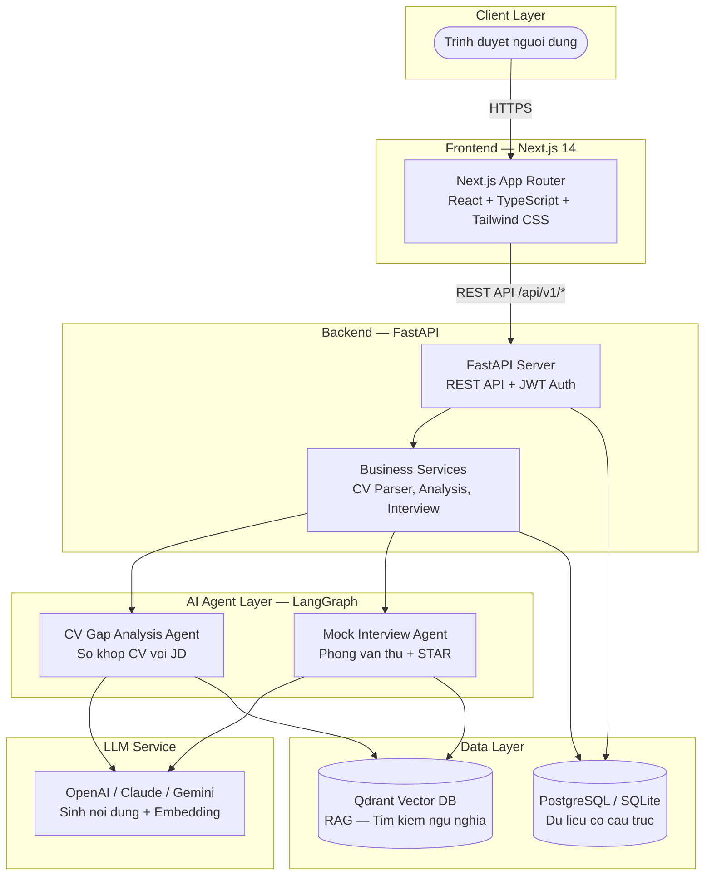
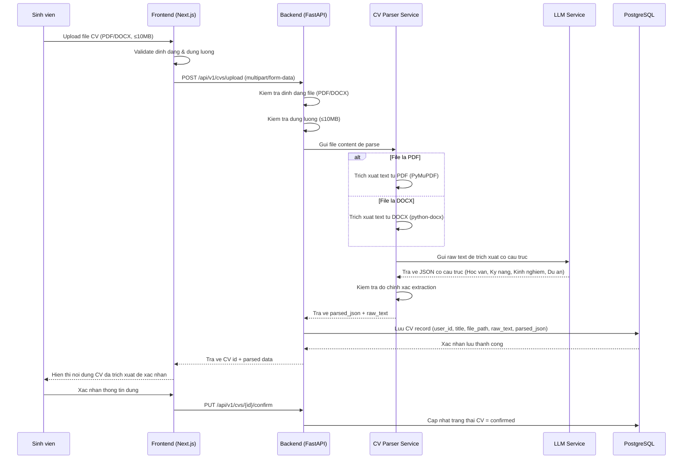
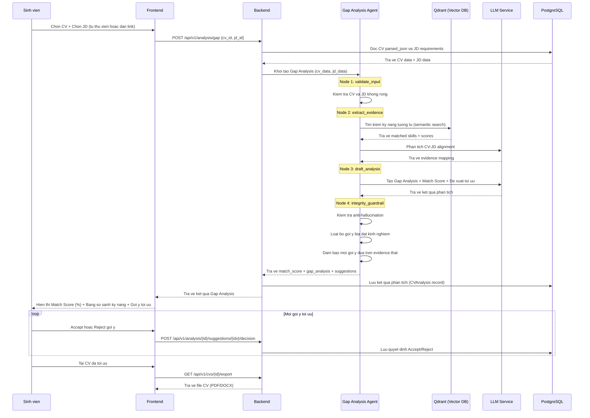
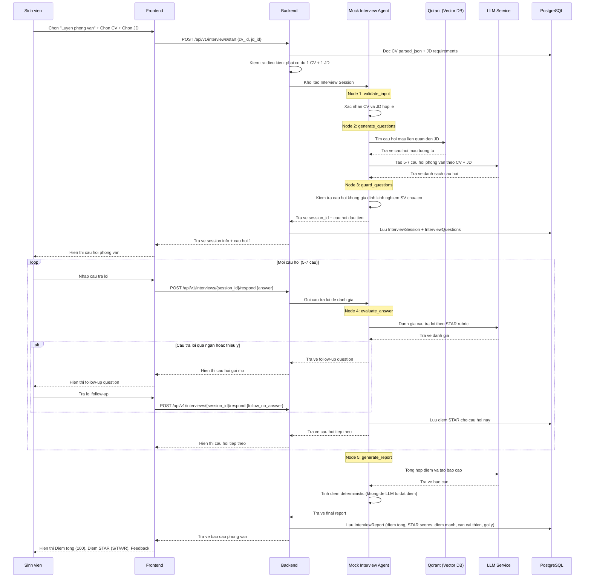
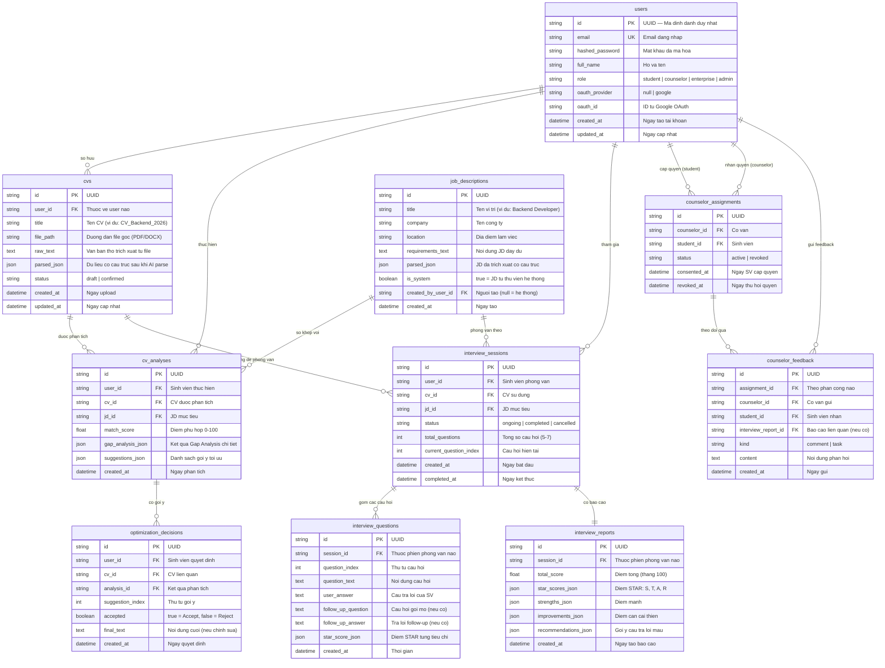
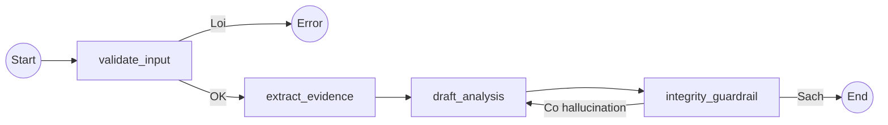
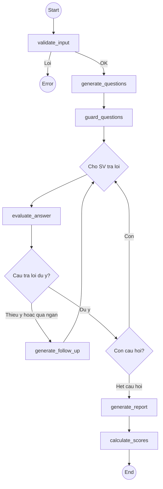

# System Architecture — CV Assistant (my_version)

> **Ma du an:** P-041 (my_version) | **Phien ban:** v1.0 | **Ngay:** 14/08/2026
> **Tac gia:** agent_architect (Tech Lead & System Architect)
> **Tham chieu:** PRD v1.0, P-041 (WinTop) architecture

---

## Muc luc

1. [Tong quan He thong (System Overview)](#1-tong-quan-he-thong)
2. [Data Flow Diagrams](#2-data-flow-diagrams)
3. [Database Schema](#3-database-schema)
4. [API Contract](#4-api-contract)
5. [LangGraph Agent Design](#5-langgraph-agent-design)
6. [Technology Decisions (ADR)](#6-technology-decisions-adr)

---

## 1. Tong quan He thong

### 1.1 High-Level Architecture



### 1.2 Giai thich tung thanh phan

| Thanh phan | Cong nghe | Lam gi? | Tai sao can? |
|---|---|---|---|
| **Frontend** | Next.js 14, React, TypeScript, Tailwind CSS | Giao dien nguoi dung: trang dang nhap, upload CV, xem Gap Analysis, phong phong van, dashboard co van | Nguoi dung tuong tac voi he thong qua trinh duyet web. Next.js ho tro SSR (Server-Side Rendering) giup trang tai nhanh hon. |
| **Backend API** | FastAPI (Python 3.11) | Xu ly logic nghiep vu: nhan request tu frontend, goi AI agent, doc/ghi database, tra ve ket qua | FastAPI la "bo nao" cua he thong — noi moi thu duoc dieu phoi. No nhan lenh tu frontend va phan cong cho AI agent hoac database. |
| **CV Gap Analysis Agent** | LangGraph | So khop CV voi JD, tim khoang cach ky nang, de xuat toi uu CV | Day la AI agent chinh — no doc CV va JD, so sanh chung, va dua ra goi y cu the de sinh vien cai thien CV. |
| **Mock Interview Agent** | LangGraph | To chuc phong van thu, dat cau hoi theo JD, cham diem STAR | AI agent thu hai — no dong vai nha tuyen dung, hoi sinh vien va cham diem cau tra loi theo tieu chi STAR. |
| **LLM Service** | OpenAI / Claude / Gemini | Sinh noi dung thong minh: phan tich CV, tao cau hoi, danh gia cau tra loi | Day la "tri tue" cua he thong. LLM (Large Language Model) la mo hinh AI lon co kha nang hieu va sinh ngon ngu tu nhien. |
| **PostgreSQL / SQLite** | PostgreSQL (prod), SQLite (dev) | Luu tru du lieu co cau truc: tai khoan nguoi dung, CV, JD, ket qua phan tich, lich su phong van | Database la "bo nho dai han" cua he thong. Moi thong tin quan trong (ai da dang nhap, CV nao da upload, diem phong van bao nhieu) deu duoc luu o day. |
| **Qdrant Vector DB** | Qdrant | Tim kiem tuong tu ngu nghia: tim JD phu hop nhat, tim mau cau hoi phong van lien quan | Vector DB la loai database dac biet, luu tru du lieu duoi dang "vector" (day so) de tim kiem theo Y NGHIA thay vi chi tim theo tu khoa chinh xac. Vi du: tim "Python developer" cung tra ve "Backend engineer with Python". |

> **Giai thich don gian ve Vector DB:**
> Database thuong (PostgreSQL) luu du lieu nhu bang tinh — ban tim theo dung ten, dung email. Vector DB (Qdrant) luu du lieu duoi dang "vector" — la mot day so dai dai dien cho Y NGHIA cua van ban. Khi ban tim "kinh nghiem lam web", no se tra ve ca nhung CV viet "phat trien ung dung web" hoac "xay dung website" — vi chung co NGHIA tuong tu du dung tu khac nhau. Day la nen tang cua cong nghe RAG (Retrieval-Augmented Generation).

---

## 2. Data Flow Diagrams

### 2.1 Flow 1: CV Upload → Parse → Store (F-02)



### 2.2 Flow 2: Gap Analysis → Optimization (F-03, F-04)



### 2.3 Flow 3: Mock Interview → STAR Scoring (F-05, F-06)



---

## 3. Database Schema

### 3.1 Tong quan

> **Database la gi?** Database (co so du lieu) la noi he thong luu tru tat ca thong tin lau dai. Khi ban tat may va bat lai, du lieu van con. Chung ta dung PostgreSQL cho moi truong production (trien khai that) va SQLite cho moi truong development (lap trinh thu nghiem) vi SQLite don gian hon, khong can cai dat server rieng.

> **ORM la gi?** ORM (Object-Relational Mapping) cho phep chung ta lam viec voi database bang code Python thay vi phai viet cau lenh SQL truc tiep. Chung ta dung SQLAlchemy lam ORM va Alembic de quan ly migration (thay doi cau truc database theo thoi gian).

### 3.2 ER Diagram (Entity-Relationship)



### 3.3 Chi tiet tung bang

#### 3.3.1 Bang `users` — Nguoi dung

**Luu gi:** Thong tin tai khoan cua tat ca nguoi dung (sinh vien, co van, doanh nghiep, admin).

**Tai sao can:** Moi hanh dong tren he thong deu can biet "ai dang lam" de phan quyen va bao mat.

| Cot | Kieu du lieu | Bat buoc | Mo ta |
|---|---|---|---|
| `id` | VARCHAR(36) PK | Co | UUID — Ma dinh danh duy nhat, tu dong tao |
| `email` | VARCHAR(255) UNIQUE | Co | Email dang nhap, khong duoc trung |
| `hashed_password` | VARCHAR(255) | Co | Mat khau da ma hoa (bcrypt), KHONG BAO GIO luu mat khau goc |
| `full_name` | VARCHAR(255) | Co | Ho ten day du |
| `role` | VARCHAR(50) | Co | Vai tro: `student`, `counselor`, `enterprise`, `admin` |
| `oauth_provider` | VARCHAR(50) | Khong | Nha cung cap OAuth (vd: `google`) |
| `oauth_id` | VARCHAR(255) | Khong | ID tu nha cung cap OAuth |
| `created_at` | TIMESTAMP | Co | Tu dong ghi khi tao |
| `updated_at` | TIMESTAMP | Co | Tu dong cap nhat |

> **Giai thich role:**
> - `student`: Sinh vien — upload CV, phan tich Gap, phong van thu
> - `counselor`: Co van huong nghiep — xem tien do va bao cao cua SV duoc phan cong
> - `enterprise`: Doanh nghiep — dang JD, xem ho so ung tuyen (Phase 2)
> - `admin`: Quan tri vien — quan ly he thong

#### 3.3.2 Bang `cvs` — CV cua sinh vien

**Luu gi:** Moi ban CV ma sinh vien upload hoac tao, bao gom ca noi dung tho (raw text) va noi dung da trich xuat co cau truc (parsed JSON).

**Tai sao can:** Day la du lieu dau vao chinh cho Gap Analysis va Mock Interview. Moi SV co the co nhieu ban CV.

| Cot | Kieu du lieu | Bat buoc | Mo ta |
|---|---|---|---|
| `id` | VARCHAR(36) PK | Co | UUID |
| `user_id` | VARCHAR(36) FK → users | Co | SV so huu CV nay |
| `title` | VARCHAR(255) | Co | Ten CV do SV dat |
| `file_path` | VARCHAR(500) | Khong | Duong dan file goc da upload |
| `raw_text` | TEXT | Khong | Van ban tho trich xuat tu PDF/DOCX |
| `parsed_json` | JSON | Khong | Du lieu co cau truc: `{education: [...], skills: [...], experience: [...], projects: [...]}` |
| `status` | VARCHAR(20) | Co | `draft` (vua upload, chua xac nhan) hoac `confirmed` (SV da xac nhan noi dung dung) |
| `created_at` | TIMESTAMP | Co | Ngay upload |
| `updated_at` | TIMESTAMP | Co | Ngay cap nhat |

#### 3.3.3 Bang `job_descriptions` — Mo ta cong viec (JD)

**Luu gi:** Cac JD tu thu vien he thong hoac do nguoi dung dan vao.

**Tai sao can:** JD la muc tieu de so khop voi CV. He thong can luu JD de tai su dung va so sanh.

| Cot | Kieu du lieu | Bat buoc | Mo ta |
|---|---|---|---|
| `id` | VARCHAR(36) PK | Co | UUID |
| `title` | VARCHAR(255) | Co | Ten vi tri (vd: "Backend Developer") |
| `company` | VARCHAR(255) | Khong | Ten cong ty |
| `location` | VARCHAR(255) | Khong | Dia diem lam viec |
| `requirements_text` | TEXT | Co | Noi dung JD day du (plain text) |
| `parsed_json` | JSON | Khong | JD da phan tach thanh atomic requirements |
| `is_system` | BOOLEAN | Co | `true` = JD tu thu vien san cua he thong |
| `created_by_user_id` | VARCHAR(36) FK → users | Khong | Nguoi tao (null = he thong tu them) |
| `created_at` | TIMESTAMP | Co | Ngay tao |

#### 3.3.4 Bang `cv_analyses` — Ket qua Gap Analysis

**Luu gi:** Moi lan sinh vien chay Gap Analysis (so khop CV voi JD), he thong luu ket qua o day.

**Tai sao can:** De SV xem lai lich su phan tich, co van theo doi tien do, va so sanh truoc/sau toi uu.

| Cot | Kieu du lieu | Bat buoc | Mo ta |
|---|---|---|---|
| `id` | VARCHAR(36) PK | Co | UUID |
| `user_id` | VARCHAR(36) FK → users | Co | SV thuc hien |
| `cv_id` | VARCHAR(36) FK → cvs | Co | CV duoc phan tich |
| `jd_id` | VARCHAR(36) FK → job_descriptions | Co | JD muc tieu |
| `match_score` | FLOAT | Co | Diem phu hop 0–100 (%) |
| `gap_analysis_json` | JSON | Khong | Chi tiet: skills matched, skills missing, experience gaps |
| `suggestions_json` | JSON | Khong | Danh sach goi y toi uu (moi goi y co: vi tri, noi dung goc, noi dung goi y, ly do) |
| `created_at` | TIMESTAMP | Co | Ngay phan tich |

> **Cau truc `gap_analysis_json` mau:**
> ```json
> {
>   "matched_skills": ["Python", "FastAPI", "PostgreSQL"],
>   "missing_skills": ["Docker", "Kubernetes"],
>   "partial_skills": ["AWS (co nhung chua du)"],
>   "experience_gap": {"required": "3 nam", "actual": "2 nam 6 thang"},
>   "education_match": true,
>   "overall_assessment": "CV phu hop 72% voi JD..."
> }
> ```

#### 3.3.5 Bang `optimization_decisions` — Quyet dinh Accept/Reject goi y

**Luu gi:** Moi quyet dinh cua SV khi Accept hoac Reject tung goi y toi uu CV.

**Tai sao can:** Day la HITL (Human-in-the-Loop) — dam bao SV co quyen kiem soat noi dung CV cuoi cung. He thong khong tu dong sua CV.

| Cot | Kieu du lieu | Bat buoc | Mo ta |
|---|---|---|---|
| `id` | VARCHAR(36) PK | Co | UUID |
| `user_id` | VARCHAR(36) FK → users | Co | SV quyet dinh |
| `cv_id` | VARCHAR(36) FK → cvs | Co | CV lien quan |
| `analysis_id` | VARCHAR(36) FK → cv_analyses | Co | Ket qua phan tich chua goi y nay |
| `suggestion_index` | INTEGER | Co | Thu tu goi y (0, 1, 2...) |
| `accepted` | BOOLEAN | Co | `true` = Accept, `false` = Reject |
| `final_text` | TEXT | Khong | Noi dung cuoi (SV co the chinh sua truoc khi Accept) |
| `created_at` | TIMESTAMP | Co | Ngay quyet dinh |

#### 3.3.6 Bang `interview_sessions` — Phien phong van thu

**Luu gi:** Moi phien phong van thu (mock interview) cua sinh vien.

**Tai sao can:** Moi lan SV luyen phong van la mot phien rieng biet, voi CV va JD cu the. Can theo doi trang thai (dang dien ra / da xong) va so cau hoi.

| Cot | Kieu du lieu | Bat buoc | Mo ta |
|---|---|---|---|
| `id` | VARCHAR(36) PK | Co | UUID |
| `user_id` | VARCHAR(36) FK → users | Co | SV phong van |
| `cv_id` | VARCHAR(36) FK → cvs | Co | CV su dung cho phien nay |
| `jd_id` | VARCHAR(36) FK → job_descriptions | Co | JD muc tieu |
| `status` | VARCHAR(50) | Co | `ongoing` (dang dien ra), `completed` (da xong), `cancelled` |
| `total_questions` | INTEGER | Co | So cau hoi (5-7) |
| `current_question_index` | INTEGER | Co | Cau hoi hien tai (0-based) |
| `created_at` | TIMESTAMP | Co | Ngay bat dau phien |
| `completed_at` | TIMESTAMP | Khong | Ngay ket thuc phien |

#### 3.3.7 Bang `interview_questions` — Cau hoi va cau tra loi phong van

**Luu gi:** Tung cau hoi trong phien phong van, cau tra loi cua SV, follow-up question (neu co), va diem STAR.

**Tai sao can:** Luu chi tiet tung cau de tao bao cao STAR chinh xac va de SV xem lai.

| Cot | Kieu du lieu | Bat buoc | Mo ta |
|---|---|---|---|
| `id` | VARCHAR(36) PK | Co | UUID |
| `session_id` | VARCHAR(36) FK → interview_sessions | Co | Thuoc phien nao |
| `question_index` | INTEGER | Co | Thu tu cau hoi (0, 1, 2...) |
| `question_text` | TEXT | Co | Noi dung cau hoi |
| `user_answer` | TEXT | Khong | Cau tra loi cua SV |
| `follow_up_question` | TEXT | Khong | Cau hoi goi mo khi SV tra loi thieu y |
| `follow_up_answer` | TEXT | Khong | Tra loi follow-up cua SV |
| `star_score_json` | JSON | Khong | Diem STAR: `{"situation": 20, "task": 25, "action": 30, "result": 15}` |
| `created_at` | TIMESTAMP | Co | Thoi gian |

#### 3.3.8 Bang `interview_reports` — Bao cao phong van STAR

**Luu gi:** Bao cao tong hop sau moi phien phong van: diem tong, diem STAR tung tieu chi, diem manh, diem can cai thien, goi y.

**Tai sao can:** Day la san pham cuoi cung cua phong van thu — SV xem de biet minh can cai thien gi, co van xem de ho tro.

| Cot | Kieu du lieu | Bat buoc | Mo ta |
|---|---|---|---|
| `id` | VARCHAR(36) PK | Co | UUID |
| `session_id` | VARCHAR(36) FK → interview_sessions (UNIQUE) | Co | Moi phien chi co duy nhat 1 bao cao |
| `total_score` | FLOAT | Co | Diem tong (thang 100) |
| `star_scores_json` | JSON | Khong | Diem trung binh tung tieu chi STAR |
| `strengths_json` | JSON | Khong | Danh sach diem manh |
| `improvements_json` | JSON | Khong | Danh sach diem can cai thien |
| `recommendations_json` | JSON | Khong | Goi y cau tra loi mau toi uu |
| `created_at` | TIMESTAMP | Co | Ngay tao bao cao |

> **Cau truc `star_scores_json` mau:**
> ```json
> {
>   "situation": {"avg_score": 18.5, "max": 25, "feedback": "Mo ta boi canh kha ro rang"},
>   "task": {"avg_score": 20.0, "max": 25, "feedback": "Neu duoc nhiem vu cu the"},
>   "action": {"avg_score": 22.0, "max": 25, "feedback": "Hanh dong chi tiet, co so lieu"},
>   "result": {"avg_score": 15.0, "max": 25, "feedback": "Can bo sung ket qua cu the hon"}
> }
> ```

#### 3.3.9 Bang `counselor_assignments` — Phan cong co van

**Luu gi:** Moi quan he giua co van va sinh vien — ai duoc phep xem du lieu cua ai.

**Tai sao can:** Co van chi duoc xem du lieu cua SV da cap quyen hoac duoc phan cong. Day la co che bao ve quyen rieng tu cua SV.

| Cot | Kieu du lieu | Bat buoc | Mo ta |
|---|---|---|---|
| `id` | VARCHAR(36) PK | Co | UUID |
| `counselor_id` | VARCHAR(36) FK → users | Co | Co van duoc cap quyen |
| `student_id` | VARCHAR(36) FK → users | Co | SV cap quyen |
| `status` | VARCHAR(20) | Co | `active` hoac `revoked` (SV thu hoi quyen) |
| `consented_at` | TIMESTAMP | Co | Ngay SV dong y |
| `revoked_at` | TIMESTAMP | Khong | Ngay SV thu hoi |

#### 3.3.10 Bang `counselor_feedback` — Phan hoi cua co van

**Luu gi:** Nhan xet hoac bai tap bo sung ma co van gui cho SV.

**Tai sao can:** Co van can gui phan hoi ca nhan hoa de ho tro SV ngoai AI.

| Cot | Kieu du lieu | Bat buoc | Mo ta |
|---|---|---|---|
| `id` | VARCHAR(36) PK | Co | UUID |
| `assignment_id` | VARCHAR(36) FK → counselor_assignments | Co | Theo phan cong nao |
| `counselor_id` | VARCHAR(36) FK → users | Co | Co van gui |
| `student_id` | VARCHAR(36) FK → users | Co | SV nhan |
| `interview_report_id` | VARCHAR(36) FK → interview_reports | Khong | Bao cao phong van lien quan (neu co) |
| `kind` | VARCHAR(20) | Co | `comment` (nhan xet) hoac `task` (bai tap) |
| `content` | TEXT | Co | Noi dung phan hoi |
| `created_at` | TIMESTAMP | Co | Ngay gui |

---

## 4. API Contract

### 4.1 Tong quan

- **Base URL:** `/api/v1`
- **Authentication:** JWT Bearer Token (ngoai tru endpoints dang ky/dang nhap)
- **Format:** JSON (request body & response)
- **Error format:** `{"detail": "Mo ta loi", "status_code": 4xx/5xx}`

### 4.2 Auth Endpoints (F-01)

| Method | Path | Mo ta | Auth? | Request Body | Response |
|---|---|---|---|---|---|
| `POST` | `/auth/register` | Dang ky tai khoan moi | Khong | `{email, password, full_name, role}` | `{id, email, full_name, role, created_at}` |
| `POST` | `/auth/login` | Dang nhap bang email/password | Khong | `{email, password}` | `{access_token, token_type, user: {id, email, role}}` |
| `POST` | `/auth/google` | Dang nhap bang Google OAuth | Khong | `{google_token}` | `{access_token, token_type, user: {id, email, role}}` |
| `GET` | `/auth/me` | Lay thong tin user hien tai | Co | — | `{id, email, full_name, role, created_at}` |
| `POST` | `/auth/password/reset-request` | Yeu cau dat lai mat khau | Khong | `{email}` | `{message: "OTP sent"}` |
| `POST` | `/auth/password/reset` | Dat lai mat khau bang OTP | Khong | `{email, otp, new_password}` | `{message: "Password reset successful"}` |

### 4.3 CV Endpoints (F-02)

| Method | Path | Mo ta | Auth? | Request Body | Response |
|---|---|---|---|---|---|
| `POST` | `/cvs/upload` | Upload file CV (PDF/DOCX) | Co | `multipart/form-data: file, title` | `{id, title, raw_text, parsed_json, status, created_at}` |
| `GET` | `/cvs` | Lay danh sach CV cua user | Co | — | `[{id, title, status, created_at}]` |
| `GET` | `/cvs/{id}` | Xem chi tiet 1 CV | Co | — | `{id, title, raw_text, parsed_json, status, created_at}` |
| `PUT` | `/cvs/{id}/confirm` | Xac nhan noi dung CV da dung | Co | — | `{id, status: "confirmed"}` |
| `PUT` | `/cvs/{id}` | Cap nhat thong tin CV | Co | `{title, parsed_json}` | `{id, title, parsed_json, updated_at}` |
| `DELETE` | `/cvs/{id}` | Xoa CV | Co | — | `{message: "Deleted"}` |
| `GET` | `/cvs/{id}/export` | Tai CV da toi uu (PDF/DOCX) | Co | Query: `?format=pdf` | File download (binary) |

### 4.4 JD Endpoints (F-03)

| Method | Path | Mo ta | Auth? | Request Body | Response |
|---|---|---|---|---|---|
| `GET` | `/jds` | Lay danh sach JD tu thu vien he thong | Co | Query: `?search=keyword` | `[{id, title, company, location, created_at}]` |
| `GET` | `/jds/{id}` | Xem chi tiet 1 JD | Co | — | `{id, title, company, requirements_text, parsed_json}` |
| `POST` | `/jds/paste` | Dan JD tu ben ngoai | Co | `{title, company, requirements_text}` | `{id, title, company, parsed_json, created_at}` |

### 4.5 Analysis Endpoints (F-03, F-04)

| Method | Path | Mo ta | Auth? | Request Body | Response |
|---|---|---|---|---|---|
| `POST` | `/analysis/gap` | Chay Gap Analysis CV vs JD | Co | `{cv_id, jd_id}` | `{id, match_score, gap_analysis, suggestions, created_at}` |
| `GET` | `/analysis/{id}` | Xem ket qua phan tich | Co | — | `{id, match_score, gap_analysis, suggestions}` |
| `GET` | `/analysis/history` | Lich su phan tich cua user | Co | Query: `?cv_id=xxx` | `[{id, cv_id, jd_id, match_score, created_at}]` |
| `POST` | `/analysis/{id}/suggestions/{index}/decision` | Accept/Reject 1 goi y | Co | `{accepted: true/false, final_text: "..."}` | `{id, suggestion_index, accepted, final_text}` |

> **Chi tiet Response `POST /analysis/gap`:**
> ```json
> {
>   "id": "analysis_uuid",
>   "match_score": 72.5,
>   "gap_analysis": {
>     "matched_skills": [
>       {"skill": "Python", "match_type": "EXACT", "evidence": "3 nam kinh nghiem..."}
>     ],
>     "missing_skills": [
>       {"skill": "Kubernetes", "priority": "preferred", "note": "JD yeu cau nhung CV khong co"}
>     ],
>     "experience_assessment": {
>       "required_years": 3,
>       "actual_years": 2.5,
>       "gap": "6 thang"
>     }
>   },
>   "suggestions": [
>     {
>       "index": 0,
>       "section": "experience",
>       "original": "Xay dung API cho he thong quan ly",
>       "suggested": "Thiet ke va xay dung RESTful API phuc vu 500+ nguoi dung cho he thong quan ly noi bo",
>       "reason": "Bo sung Action Verb va so lieu cu the tu kinh nghiem goc"
>     }
>   ]
> }
> ```

### 4.6 Interview Endpoints (F-05, F-06)

| Method | Path | Mo ta | Auth? | Request Body | Response |
|---|---|---|---|---|---|
| `POST` | `/interviews/start` | Bat dau phien phong van thu | Co | `{cv_id, jd_id, total_questions: 5-7}` | `{session_id, status, first_question, total_questions}` |
| `POST` | `/interviews/{session_id}/respond` | Gui cau tra loi | Co | `{answer: "..."}` | `{next_question, is_follow_up, current_index, status}` |
| `GET` | `/interviews/{session_id}` | Xem trang thai phien hien tai | Co | — | `{session_id, status, current_index, total_questions}` |
| `GET` | `/interviews/{session_id}/report` | Lay bao cao STAR sau khi hoan thanh | Co | — | `{total_score, star_scores, strengths, improvements, recommendations}` |
| `GET` | `/interviews/history` | Lich su phong van cua user | Co | — | `[{session_id, jd_title, total_score, status, created_at}]` |

> **Chi tiet Response `POST /interviews/start`:**
> ```json
> {
>   "session_id": "session_uuid",
>   "status": "ongoing",
>   "total_questions": 5,
>   "current_index": 0,
>   "first_question": {
>     "index": 0,
>     "text": "Hay ke ve mot du an ma ban da su dung Python de giai quyet van de thuc te."
>   }
> }
> ```

> **Chi tiet Response `POST /interviews/{session_id}/respond`:**
> ```json
> {
>   "current_index": 1,
>   "is_follow_up": false,
>   "status": "ongoing",
>   "next_question": {
>     "index": 1,
>     "text": "Trong du an do, ban da xu ly hieu suat (performance) cua API nhu the nao?"
>   }
> }
> ```
> Truong hop follow-up:
> ```json
> {
>   "current_index": 0,
>   "is_follow_up": true,
>   "status": "ongoing",
>   "next_question": {
>     "index": 0,
>     "text": "Ban co the neu cu the ket qua dat duoc khong? Vi du so lieu, feedback tu nguoi dung?"
>   }
> }
> ```

> **Chi tiet Response `GET /interviews/{session_id}/report`:**
> ```json
> {
>   "session_id": "session_uuid",
>   "total_score": 75.5,
>   "star_scores": {
>     "situation": {"score": 18.5, "max": 25, "feedback": "..."},
>     "task": {"score": 20.0, "max": 25, "feedback": "..."},
>     "action": {"score": 22.0, "max": 25, "feedback": "..."},
>     "result": {"score": 15.0, "max": 25, "feedback": "..."}
>   },
>   "strengths": ["Trinh bay logic ro rang", "Co so lieu cu the"],
>   "improvements": ["Can mo ta ket qua cu the hon", "Nen lien he voi tac dong kinh doanh"],
>   "recommendations": [
>     {
>       "question_index": 2,
>       "sample_answer": "Toi da toi uu hoa truy van SQL, giam thoi gian phan hoi API tu 2s xuong 200ms..."
>     }
>   ]
> }
> ```

### 4.7 Counselor Endpoints (F-07)

| Method | Path | Mo ta | Auth? | Request Body | Response |
|---|---|---|---|---|---|
| `GET` | `/counselor/students` | Danh sach SV duoc phan cong | Co (counselor) | — | `[{student_id, full_name, email, status}]` |
| `GET` | `/counselor/students/{student_id}/overview` | Tong quan tien do 1 SV | Co (counselor) | — | `{total_cvs, total_analyses, total_interviews, avg_interview_score}` |
| `GET` | `/counselor/students/{student_id}/analyses` | Lich su Gap Analysis cua SV | Co (counselor) | — | `[{id, cv_title, jd_title, match_score, created_at}]` |
| `GET` | `/counselor/students/{student_id}/interviews` | Lich su phong van cua SV | Co (counselor) | — | `[{session_id, jd_title, total_score, created_at}]` |
| `GET` | `/counselor/students/{student_id}/interviews/{session_id}/report` | Xem bao cao phong van cua SV | Co (counselor) | — | (giong Interview report response) |
| `POST` | `/counselor/feedback` | Gui nhan xet/bai tap cho SV | Co (counselor) | `{student_id, kind, content, interview_report_id?}` | `{id, created_at}` |
| `GET` | `/counselor/dashboard` | Thong ke tong hop | Co (counselor) | — | `{total_students, total_cvs_optimized, total_interviews, avg_score}` |

### 4.8 Student-side Counselor Endpoints

| Method | Path | Mo ta | Auth? | Request Body | Response |
|---|---|---|---|---|---|
| `POST` | `/students/counselor/grant` | Cap quyen cho co van xem du lieu | Co (student) | `{counselor_email}` | `{assignment_id, status: "active"}` |
| `DELETE` | `/students/counselor/{assignment_id}` | Thu hoi quyen | Co (student) | — | `{status: "revoked"}` |
| `GET` | `/students/counselor/feedback` | Xem phan hoi tu co van | Co (student) | — | `[{id, counselor_name, kind, content, created_at}]` |

---

## 5. LangGraph Agent Design

### 5.1 Tong quan

> **LangGraph la gi?** LangGraph la thu vien giup xay dung AI agent theo dang "graph" (do thi). Moi node trong graph la mot buoc xu ly, va cac canh (edge) quyet dinh buoc nao chay truoc, buoc nao chay sau. Nhu mot "day chuyen san xuat" — moi tram lam mot viec cu the, san pham di tu tram nay sang tram khac.

He thong co 2 AI agent chinh:

1. **CV Gap Analysis Agent** — so khop CV voi JD, tim khoang cach ky nang, de xuat toi uu
2. **Mock Interview Agent** — to chuc phong van thu, cham diem STAR

### 5.2 CV Gap Analysis Agent

#### Graph Diagram



#### Mo ta tung Node

| Node | Lam gi | Input | Output |
|---|---|---|---|
| **validate_input** | Kiem tra CV va JD co du lieu khong, dinh dang dung khong | `cv_parsed_json`, `jd_requirements` | Pass/Fail |
| **extract_evidence** | Trich xuat ky nang, kinh nghiem tu CV; tach JD thanh atomic requirements; dung Qdrant tim kiem semantic de match skills | `cv_parsed_json`, `jd_parsed_json` | `evidence`, `rubric` |
| **draft_analysis** | Goi LLM de phan tich Gap, tinh Match Score, tao goi y toi uu | `evidence`, `rubric` | `draft_result` (match_score, gaps, suggestions) |
| **integrity_guardrail** | Kiem tra moi goi y dua tren evidence that. Loai bo: ky nang SV chua khai bao, du an bia dat, so lieu thoi phong | `draft_result`, `evidence` | `gap_analysis_result` (da loc sach) |

#### State Schema

```python
class GapAnalysisState(TypedDict, total=False):
    # Input
    cv_raw_text: str                    # Van ban tho cua CV
    cv_parsed_json: dict[str, Any]      # CV da parse co cau truc
    jd_title: str                       # Ten vi tri (vd: "Backend Developer")
    jd_requirements: str                # Noi dung JD
    jd_parsed_json: dict[str, Any]      # JD da parse co cau truc

    # Intermediate
    rubric: dict[str, Any]              # Tieu chi danh gia (weights)
    evidence: dict[str, Any]            # Ky nang da match + nguon
    draft_result: dict[str, Any]        # Ket qua nhap (chua qua guardrail)

    # Output
    gap_analysis_result: dict[str, Any] # Ket qua cuoi cung (da qua guardrail)
    error: str                          # Thong bao loi (neu co)
```

#### Tools su dung

| Tool | Muc dich |
|---|---|
| **qdrant_search** | Tim kiem semantic trong Vector DB de match ky nang CV voi JD |
| **skill_normalizer** | Chuan hoa ten ky nang (vd: "Postgres" → "PostgreSQL") |
| **llm_structured_extract** | Goi LLM de trich xuat co cau truc tu raw text |
| **evidence_validator** | Kiem tra moi goi y co evidence ho tro khong |

#### Anti-Hallucination Guardrails

Node `integrity_guardrail` thuc hien cac kiem tra sau:

1. **Kiem tra ky nang khong ton tai:** Neu goi y noi SV co ky nang X nhung `cv_parsed_json` khong chua ky nang X → loai bo goi y.
2. **Kiem tra du an bia dat:** Neu goi y nhac den du an hoac cong ty ma SV chua khai bao → loai bo.
3. **Kiem tra so lieu thoi phong:** Neu goi y them so lieu dinh luong (vd: "10,000 users", "giup tang 50% doanh thu") ma CV goc khong co → loai bo.
4. **Kiem tra nang cap chuc danh:** Neu goi y doi "Software Engineer" thanh "Senior Engineer" → loai bo.
5. **JD leakage check:** Neu goi y lay yeu cau tu JD va gia dinh SV co ky nang do → loai bo.

> **Nguyen tac cot loi:** Goi y chi duoc phep toi uu CACH TRINH BAY kinh nghiem that — khong duoc BIA them kinh nghiem moi.

### 5.3 Mock Interview Agent

#### Graph Diagram



#### Mo ta tung Node

| Node | Lam gi | Input | Output |
|---|---|---|---|
| **validate_input** | Kiem tra da chon du CV + JD chua. Neu thieu → tu choi bat dau | `cv_id`, `jd_id` | Pass/Fail |
| **generate_questions** | Goi LLM + Qdrant de tao 5-7 cau hoi phong van phu hop voi JD va CV | `cv_parsed_json`, `jd_requirements` | `interview_questions` |
| **guard_questions** | Kiem tra cau hoi khong gia dinh kinh nghiem SV chua co. Vi du: JD yeu cau Kubernetes nhung CV khong co → duoc hoi kien thuc chung ve Kubernetes, nhung KHONG duoc hoi "Trong du an Kubernetes cua ban..." | `interview_questions`, `cv_parsed_json` | `interview_questions` (da loc) |
| **evaluate_answer** | Goi LLM danh gia cau tra loi theo rubric STAR (Situation, Task, Action, Result) | `question_text`, `user_answer` | `star_score_json`, `needs_follow_up` |
| **generate_follow_up** | Tao cau hoi goi mo khi SV tra loi thieu y. Vi du: "Ban co the neu cu the ket qua dat duoc khong?" | `question_text`, `user_answer`, `star_score_json` | `follow_up_question` |
| **generate_report** | Tong hop ket qua toan phien phong van | `qa_history`, `star_scores` | `final_report` (narrative) |
| **calculate_scores** | Tinh diem deterministic (KHONG de LLM tu dat diem cuoi cung) | `star_scores` (all questions) | `total_score`, `star_averages` |

#### State Schema

```python
class InterviewAgentState(TypedDict, total=False):
    # Session info
    operation: Literal["start", "evaluate", "report"]
    session_id: str

    # Input
    cv_text: str                        # Van ban CV
    cv_parsed_json: dict[str, Any]      # CV da parse
    jd_title: str                       # Ten vi tri
    jd_requirements: str                # Noi dung JD
    num_questions: int                  # So cau hoi (5-7)

    # Current turn
    question_text: str                  # Cau hoi hien tai
    user_answer: str                    # Cau tra loi cua SV
    is_follow_up: bool                 # Co phai follow-up khong
    follow_up_question: str            # Cau hoi goi mo

    # History
    qa_history: list[dict[str, Any]]    # Lich su Q&A toan phien
    interview_questions: list[str]      # Danh sach cau hoi

    # Evaluation
    answer_evaluation: dict[str, Any]   # Danh gia cau tra loi hien tai
    star_scores: list[dict[str, Any]]   # Diem STAR tat ca cau hoi

    # Output
    final_report: dict[str, Any]        # Bao cao cuoi cung
    error: str
```

#### Tools su dung

| Tool | Muc dich |
|---|---|
| **qdrant_search** | Tim cau hoi mau tuong tu tu Question Bank |
| **llm_question_generator** | Goi LLM tao cau hoi theo CV + JD |
| **llm_answer_evaluator** | Goi LLM danh gia cau tra loi theo STAR |
| **star_score_calculator** | Tinh diem STAR deterministic (khong de LLM quyet dinh diem cuoi) |

#### Anti-Hallucination Guardrails cho Mock Interview

1. **Candidate Assumption Guard:** Cau hoi chi duoc gia dinh SV co kinh nghiem X khi CV co evidence ro rang ve X. JD chi authorize TOPIC (duoc hoi kien thuc chung), nhung Candidate Evidence moi authorize PERSONAL ASSUMPTION (duoc hoi "du an X cua ban").
2. **Diem tinh bang cong thuc, khong phai LLM:** LLM chi phan loai coverage (FULL, PARTIAL, NOT_DEMONSTRATED...), con diem cuoi cung duoc tinh bang cong thuc deterministic.
3. **Evidence-bound feedback:** Phan hoi chi dua tren nhung gi SV thuc su tra loi trong phien (transcript), khong dua tren gia dinh.

### 5.4 Rubric STAR — Cach tinh diem

> **STAR la gi?** STAR la phuong phap danh gia cau tra loi phong van:
> - **S**ituation: Ban da mo ta boi canh / tinh huong chua?
> - **T**ask: Nhiem vu cu the cua ban la gi?
> - **A**ction: Ban da lam gi de giai quyet?
> - **R**esult: Ket qua dat duoc la gi?

**Cach tinh diem:**

```
Diem moi tieu chi STAR = Coverage Factor x Max Score (25)

Coverage Factor:
  FULL              = 1.00 (tra loi day du, co so lieu)
  PARTIAL_STRONG    = 0.75 (tra loi kha day du)
  PARTIAL           = 0.50 (co nhac nhung thieu chi tiet)
  PARTIAL_WEAK      = 0.25 (tra loi so sai)
  NOT_DEMONSTRATED  = 0.00 (khong tra loi phan nay)

Diem moi cau hoi = S_score + T_score + A_score + R_score (toi da 100)
Diem tong phien  = Trung binh diem tat ca cau hoi
```

**Vi du cu the:**

SV tra loi cau hoi "Ke ve mot du an Python":
- Situation: Mo ta boi canh ro rang → FULL → 25 x 1.00 = 25
- Task: Noi nhiem vu nhung chua cu the → PARTIAL → 25 x 0.50 = 12.5
- Action: Ke chi tiet cac buoc da lam → PARTIAL_STRONG → 25 x 0.75 = 18.75
- Result: Khong nhac ket qua → NOT_DEMONSTRATED → 25 x 0.00 = 0

Diem cau hoi nay: 25 + 12.5 + 18.75 + 0 = 56.25/100

---

## 6. Technology Decisions (ADR)

> **ADR (Architecture Decision Record)** la cach ghi lai quyet dinh ky thuat quan trong: da chon gi, tai sao, va cac phuong an khac da xem xet.

### ADR-01: Backend Framework — FastAPI

| Muc | Chi tiet |
|---|---|
| **Da chon** | FastAPI (Python) |
| **Ly do chinh** | (1) Async native — xu ly nhieu request dong thoi, quan trong khi goi LLM (mat vai giay moi lan). (2) Tu dong tao API docs (Swagger UI) de frontend dev va testing. (3) Pydantic built-in — validate du lieu dau vao tu dong, giam loi. (4) Python ecosystem phu hop voi AI/ML (LangGraph, LangChain, Qdrant client). |
| **Phuong an khac** | **Django**: Manh hon (co san admin panel, ORM, auth), nhung nang ne cho du an nay. Django khong async native (phai dung ASGI rieng). **Flask**: Don gian nhung thieu type safety va async. **Express.js (Node)**: Tot nhung phai dung ecosystem khac cho AI (Python van la ngon ngu chinh cua AI/ML). |
| **Trade-off** | FastAPI khong co san admin panel nhu Django, phai tu xay. Nhung voi du an nay (7 features, solo dev), FastAPI gon nhe va phu hop hon. |

### ADR-02: Frontend Framework — Next.js 14

| Muc | Chi tiet |
|---|---|
| **Da chon** | Next.js 14 (React + TypeScript + Tailwind CSS) |
| **Ly do chinh** | (1) SSR (Server-Side Rendering) giup trang tai nhanh va SEO tot. (2) App Router moi cho phep to chuc code theo folder ro rang. (3) TypeScript dam bao type safety. (4) Tailwind CSS giup style nhanh va nhat quan. (5) Ecosystem React lon, nhieu component san. |
| **Phuong an khac** | **React SPA (Vite)**: Don gian hon nhung khong co SSR. Voi SPA, trinh duyet phai tai het JavaScript roi moi hien thi trang → cham hon. **Vue.js/Nuxt**: Tot nhung ecosystem nho hon React. **Angular**: Qua nang ne cho du an nay. |
| **Trade-off** | Next.js phuc tap hon React SPA (phai hieu SSR, Server Components). Nhung loi ich ve toc do va trai nghiem nguoi dung dang de dau tu. |

### ADR-03: Vector DB — Qdrant

| Muc | Chi tiet |
|---|---|
| **Da chon** | Qdrant |
| **Dung de lam gi** | Luu tru va tim kiem ngu nghia (semantic search) cho: JD thi truong, tieu chi ATS, mau cau hoi phong van. Day la phan RAG (Retrieval-Augmented Generation) cua he thong. |
| **Ly do chinh** | (1) Open-source, mien phi self-host. (2) Hieu nang cao, tim kiem nhanh tren tap du lieu lon. (3) Ho tro filter metadata (loc theo nganh, cap do, loai cau hoi). (4) Python client tot. (5) Docker-ready, de deploy cung he thong. |
| **Phuong an khac** | **ChromaDB**: Don gian hon, tot cho prototyping, nhung hieu nang kem hon va khong on dinh cho production. **Pinecone**: Managed service (khong can tu quan ly), nhung mat phi va phu thuoc cloud. **pgvector** (PostgreSQL extension): Tien loi vi dung chung DB, nhung hieu nang kem hon Qdrant khi du lieu lon. |
| **Trade-off** | Qdrant la mot service rieng phai chay ben canh (them phuc tap deploy). Nhung voi RAG la chuc nang cot loi, hieu nang va do tin cay cua Qdrant dang de dau tu. |

> **RAG la gi?** RAG (Retrieval-Augmented Generation) la ky thuat giup AI tra loi chinh xac hon bang cach: (1) Tim kiem thong tin lien quan tu database truoc. (2) Dua thong tin do vao context cho LLM. (3) LLM tra loi dua tren thong tin cu the thay vi chi dua vao tri nho chung. Vi du: thay vi hoi LLM "Cau hoi phong van Backend la gi?" (tra loi chung chung), RAG se tim cau hoi phong van Backend cu the tu Question Bank roi dua cho LLM de tao cau hoi phu hop voi JD cu the.

### ADR-04: Database — PostgreSQL (prod) / SQLite (dev)

| Muc | Chi tiet |
|---|---|
| **Da chon** | PostgreSQL cho production, SQLite cho development |
| **Ly do chinh** | **PostgreSQL**: (1) Relational database manh nhat open-source. (2) Ho tro JSON columns de luu du lieu ban cau truc. (3) ACID-compliant — dam bao du lieu khong bi mat khi co loi. (4) Tich hop tot voi SQLAlchemy ORM. **SQLite cho dev**: (1) Khong can cai dat server, chi la 1 file. (2) Phat trien nhanh tren may ca nhan. (3) SQLAlchemy cho phep chuyen qua lai de dang. |
| **Phuong an khac** | **MongoDB** (NoSQL): Linh hoat hon voi du lieu khong co cau truc, nhung du lieu cua chung ta (users, CVs, JDs, scores) co cau truc ro rang → relational DB phu hop hon. **MySQL**: Tot nhung PostgreSQL co nhieu tinh nang hon (JSON support, full-text search). |
| **Trade-off** | PostgreSQL can cai dat server rieng (dung Docker). SQLite co gioi han ve dong thoi (khong tot khi nhieu nguoi dung cung luc). Nhung chien luoc "SQLite dev + PostgreSQL prod" la best practice pho bien. |

> **ACID la gi?** ACID la 4 tinh chat dam bao du lieu an toan:
> - **A**tomicity: Mot giao dich hoac thanh cong hoan toan, hoac that bai hoan toan (khong co nua nua)
> - **C**onsistency: Du lieu luon dung qui tac (vd: email khong trung)
> - **I**solation: Nhieu nguoi dung dong thoi khong can tro nhau
> - **D**urability: Du lieu da luu thi khong bi mat khi mat dien

### ADR-05: AI Agent Framework — LangGraph

| Muc | Chi tiet |
|---|---|
| **Da chon** | LangGraph |
| **Ly do chinh** | (1) State machine ro rang — kiem soat chinh xac luong xu ly (khong de AI "tu do" lam gi tuy thich). (2) Nodes va edges tuong tu flowchart — de hieu va debug. (3) Tich hop tot voi LangChain ecosystem. (4) Ho tro checkpointing — luu trang thai giua cac buoc, co the resume khi loi. (5) Phu hop voi yeu cau anti-hallucination — co the chen guardrail node giua cac buoc. |
| **Phuong an khac** | **CrewAI**: Multi-agent framework, nhung thiet ke cho "doi ngu AI agent tu tuong tac" — qua phuc tap cho 2 agent cua chung ta. **AutoGen** (Microsoft): Manh cho conversation-based agent, nhung kho kiem soat luong xu ly chinh xac. **Tu viet tu dau** (plain Python): Linh hoat nhung mat nhieu thoi gian va thieu san cac tien ich (retry, checkpointing, state management). |
| **Trade-off** | LangGraph co learning curve, can hieu khai niem graph, nodes, edges, state. Nhung doi lai duoc kiem soat chinh xac luong xu ly — rat quan trong khi can anti-hallucination va HITL. |

### ADR-06: LLM Provider — Multi-provider (OpenAI / Claude / Gemini)

| Muc | Chi tiet |
|---|---|
| **Da chon** | Ho tro nhieu provider qua abstraction layer |
| **Ly do chinh** | (1) Khong bi lock-in vao 1 provider. (2) Co the chon model phu hop cho tung task (vd: model re cho parsing, model manh cho analysis). (3) Fallback khi 1 provider bi loi hoac rate-limit. |
| **Cach trien khai** | Tao `LLMService` abstract class, moi provider implement rieng. Config qua bien moi truong: `LLM_PROVIDER=openai`, `LLM_MODEL=gpt-4o`. |
| **Trade-off** | Phai maintain nhieu adapter. Nhung voi 2-3 provider, chi phi maintain hop ly. |

---

## Phu luc: Mapping Features → Components

| Feature | Frontend Pages | API Endpoints | AI Agent | DB Tables |
|---|---|---|---|---|
| **F-01** Dang nhap & Phan quyen | Login, Register | `/auth/*` | — | `users` |
| **F-02** Upload & Parse CV | Dashboard, CV Upload | `/cvs/*` | CV Parser (service) | `cvs` |
| **F-03** Match Score & Gap Analysis | Gap Analysis Results | `/analysis/gap` | CV Gap Analysis Agent | `cv_analyses` |
| **F-04** De xuat Toi uu CV (HITL) | Suggestions List | `/analysis/{id}/suggestions/*` | CV Gap Analysis Agent | `optimization_decisions` |
| **F-05** Phong van thu | Interview Room (Chat) | `/interviews/*` | Mock Interview Agent | `interview_sessions`, `interview_questions` |
| **F-06** Bao cao STAR | Interview Report | `/interviews/{id}/report` | Mock Interview Agent | `interview_reports` |
| **F-07** Dashboard Co van | Counselor Dashboard | `/counselor/*` | — | `counselor_assignments`, `counselor_feedback` |
